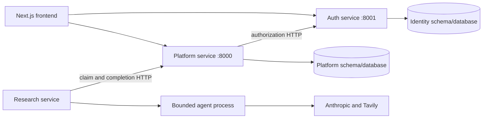

# CampusPath

Compare universities side by side on the questions that actually matter to you. Ask about fees, prerequisites, or curriculum, and an AI research agent fills in every cell with a cited answer from official sources.

## What it does

Choosing where to study means answering the same handful of questions for every university on your shortlist, one browser tab at a time. CampusPath turns that into a table you control.

You create a comparison session for a major, add universities as rows, and add your own questions as columns. Nothing about the columns is fixed: if what matters to you is scholarship deadlines or whether a co-op year is compulsory, you ask exactly that. Hit research, and the coordinator dispatches university-question pairs to parallel LangChain subagents, which search the web, read official university pages, and write short answers with the source links they actually opened. The table updates with the session result after each batch attempt; retries research only failed pairs.

## Highlights

- **Your questions, not a fixed schema.** Every column is a free-text question you write. Sessions start with Prerequisites, Fees, Location and Course description, and you add or remove columns freely.
- **Answers you can check.** Each cell carries the source URLs the agent opened. Links are validated as real URLs before they are stored, and the agent is instructed never to reconstruct or guess one, so a cell either cites a page or admits it could not verify the answer.
- **Durable research, not fire-and-forget.** Each session uses one reusable PostgreSQL job row with a lease, so a crashed or hung worker recovers instead of stranding the table. Retries are bounded at three attempts, and multiple workers can safely claim jobs concurrently via `SKIP LOCKED`.
- **Stale answers invalidate themselves.** Every job records the session revision it was created for. Change the major on a row and older in-flight results are discarded rather than written over the new question.
- **Per-row major overrides.** One session can compare the same university across different programmes, or mix programmes across universities.
- **Bring your own agent.** The research callable is configuration, not hardcoded. Point `AGENT_ENTRYPOINT` at any Python function matching the contract below.
- **Sessions are private.** Every query is scoped to the signed-in owner, backed by Google OAuth with rotating refresh tokens.

## Service architecture

All backend microservices live under `backend/` and are independently deployable:

- **auth_service**: Google authentication, sessions, refresh rotation, revocation, and authorization policy. Owns identity data.
- **platform_service**: dashboards, university comparisons, directory, and durable research queue. Owns platform data and calls auth for authorization.
- **research_service**: job consumption and agent execution. Calls platform over HTTP and owns AI provider credentials.



Services have separate dependencies, lockfiles, environment files, tests, and Dockerfiles. They never import one another's Python modules. Auth and platform have independent database URLs and migrations; local development uses separate schemas in the existing PostgreSQL database. Research has no database access.

The browser calls auth and platform directly through separately configured URLs. Platform validates sessions and resource policy through auth, and filters records by the authenticated owner. Research claims and completes jobs through platform's authenticated internal endpoints, retaining retries, leases, and revision protection.

## Quick start

Requires Python 3.11+, uv, Node.js 20+, PostgreSQL, Google OAuth credentials, and Anthropic/Tavily keys. On a fresh checkout, copy the examples without overwriting existing configuration:

```sh
cp backend/auth_service/.env.example backend/auth_service/.env
cp backend/platform_service/.env.example backend/platform_service/.env
cp backend/research_service/.env.example backend/research_service/.env
cp frontend/.env.example frontend/.env.local
```

Configure auth's database, Google credentials, and JWT signing key. Register `http://localhost:8001/auth/callback` in Google OAuth. Configure platform's database and both service tokens. Set the same `PLATFORM_SERVICE_TOKEN` in auth and platform, and a distinct matching `RESEARCH_SERVICE_TOKEN` in platform and research. Tokens must be random strings of at least 32 characters. Provider keys belong only in research.

Install and migrate each HTTP service before starting it. Stop old service processes during migration. From terminals opened at the repository root:

```sh
cd backend/auth_service
uv sync
uv run alembic upgrade head
uv run uvicorn app.main:app --reload --reload-dir app --port 8001
```

```sh
cd backend/platform_service
uv sync
uv run alembic upgrade head
uv run uvicorn app.main:app --reload --reload-dir app --port 8000
```

```sh
cd backend/research_service
uv sync
uv run python -m app.main
```

```sh
cd frontend
npm install
npm run dev
```

Open http://localhost:3000. The frontend uses `NEXT_PUBLIC_API_URL` for platform and `NEXT_PUBLIC_AUTH_URL` for auth. Research needs all three services running. Read [the backend service guide](backend/README.md) for schema migration, module layout, HTTP contracts, and independently hosted deployment configuration.

## Using the app

1. **Sign in** with Google. Sessions are private to your account.
2. **Create a session** and give it a major. The major is the default context for every question asked in that session.
3. **Add universities.** Type to search the worldwide directory, which loads once and then filters locally as you type. Institutions missing from the dataset can be entered manually.
4. **Add questions.** Each one becomes a column. Phrase them the way you would ask a person, for example "Scholarships for international students".
5. **Override the major per row** if a university should be compared on a different programme.
6. **Run research.** Cells move from `empty` through `queued` and `running` to `completed`, and the table refreshes itself every few seconds while work is outstanding. The header keeps a running count of answers.
7. **Read the sources.** Each answered cell lists the pages behind it. Re-running research retries only failed and unanswered cells, so it is safe to click again.

Editing a session's major, or a row's major override, marks affected cells stale so the next research run refreshes them.

## Session research agents

The default callable is `app.agent.agent:research` in the research service. It receives the full session definitions plus exact target row/column IDs, dispatches independent subagents concurrently, and returns `SessionResult` with one success or explicit failure per target. Source and answer validation happen in both services. See [the research contract](backend/README.md#research-boundary-and-storage) for the version 2 payload and result details.

Answers, statuses, citations, timestamps, and safe errors are stored together in one JSONB document per session. One reusable session job retries only failed pairs. The dashboard still receives its existing cell-shaped response. No-content responses are shown as errors with a retry message, and never stored as completed answers.

## Project structure

- `backend/auth_service/app/authentication/`: Google login, sessions, refresh, and revocation.
- `backend/auth_service/app/authorization/`: service-authenticated policy endpoint and owner/action decisions.
- `backend/platform_service/app/`: dashboard routes, domain logic, database models, job queue, and identity client.
- `backend/research_service/app/agent/`: session coordinator and independent research subagents.
- `backend/research_service/app/prompts/`: prompt definitions.
- `backend/research_service/app/tools/`: web and date capabilities.
- `backend/research_service/app/runtime/`: bounded executor and child-process runner.
- `backend/research_service/app/clients/`: platform transport.
- `backend/research_service/app/worker.py`: research orchestration.
- `backend/compose.yaml`: independent service containers.
- `frontend/src/`: Next.js application.

## Testing

Run `uv run pytest -q -ra` separately from each service directory. Run `backend/platform_service/.venv/bin/python -m pytest backend/integration_tests -q -ra` from the repository root to exercise all services together with real test PostgreSQL and deterministic external model/web responses. Auth and platform use their own `.env.test` with `TEST_DATABASE_URL`; example files are templates only. Use disposable test databases. The platform database contract test skips when that URL is blank.

```sh
cd frontend
npm test
npm run typecheck
npm run build
```

Google login and live provider calls require real credentials. The [backend guide](backend/README.md) documents service protocols and container startup. Development commands and migration instructions are also in the local DEVELOPMENT.md file.

## Deployment

Deploy auth, platform, and research from their own service directories. Run each HTTP service's migrations once per release. Research is a worker deployment with no inbound port. Configure service URLs and pairwise secrets independently; use TLS across untrusted networks.

The current cookie-based login requires same-site HTTPS frontend/auth/platform domains, for example `app.example.com`, `auth.example.com`, and `platform.example.com`. Configure auth's `COOKIE_DOMAIN=.example.com` and `COOKIE_SECURE=true`. Keep refresh cookies host-only on auth, configure exact frontend origins, and register the auth callback with Google. See [the backend guide](backend/README.md#independent-deployment) for details and Compose commands.
