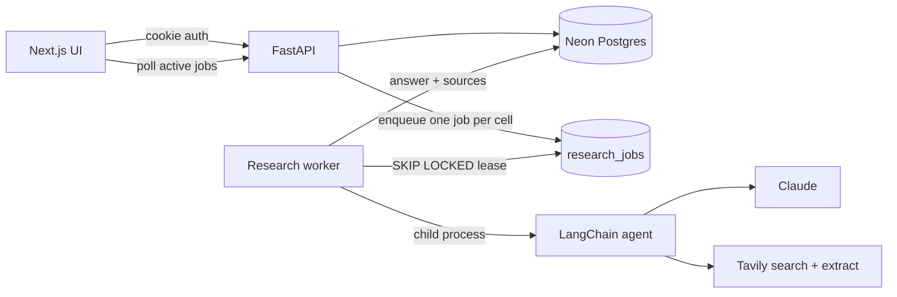

# CampusPath

Compare universities side by side on the questions that actually matter to you. Ask about fees, prerequisites, or curriculum, and an AI research agent fills in every cell with a cited answer from official sources.

## What it does

Choosing where to study means answering the same handful of questions for every university on your shortlist, one browser tab at a time. CampusPath turns that into a table you control.

You create a comparison session for a major, add universities as rows, and add your own questions as columns. Nothing about the columns is fixed: if what matters to you is scholarship deadlines or whether a co-op year is compulsory, you ask exactly that. Hit research, and a LangChain agent works through every university-question pair, searching the web, reading official university pages, and writing a short answer with the source links it actually opened. Answers stream into the table as each cell finishes.

## Highlights

- **Your questions, not a fixed schema.** Every column is a free-text question you write. Sessions start with Prerequisites, Fees, Location and Course description, and you add or remove columns freely.
- **Answers you can check.** Each cell carries the source URLs the agent opened. Links are validated as real URLs before they are stored, and the agent is instructed never to reconstruct or guess one, so a cell either cites a page or admits it could not verify the answer.
- **Durable research, not fire-and-forget.** Each cell becomes a row in a PostgreSQL job queue with a lease, so a crashed or hung worker recovers instead of stranding the table. Retries are bounded at three attempts, and multiple workers can safely claim jobs concurrently via `SKIP LOCKED`.
- **Stale answers invalidate themselves.** Every job records the cell revision it was created for. Change the major on a row and older in-flight results are discarded rather than written over the new question.
- **Per-row major overrides.** One session can compare the same university across different programmes, or mix programmes across universities.
- **Bring your own agent.** The research callable is configuration, not hardcoded. Point `AGENT_ENTRYPOINT` at any Python function matching the contract below.
- **Sessions are private.** Every query is scoped to the signed-in owner, backed by Google OAuth with rotating refresh tokens.

## Architecture



A request travels from a frontend feature through the API client to a backend router, then a service, then PostgreSQL. Research is deliberately not part of the request cycle: the API only enqueues jobs and returns, while a separate worker process claims them. The worker runs each agent invocation in a child process, which enforces a hard timeout without leaving a timed-out thread making provider calls after its job lease expires. A missing or misconfigured entry point produces a setup error, never a fabricated answer.

## Tech stack

**Frontend** - Next.js 15, React 19, TypeScript, Tailwind CSS, Vitest.

**Backend** - FastAPI, SQLAlchemy 2, Alembic, pydantic-settings, on Python 3.11+ managed with [uv](https://docs.astral.sh/uv/).

**Data and AI** - Neon PostgreSQL (any PostgreSQL works), LangChain with Claude for reasoning and Tavily for web search and page extraction.

## Prerequisites

- [uv](https://docs.astral.sh/uv/getting-started/installation/) and Python 3.11 or newer
- Node.js 20 or newer
- A PostgreSQL database. [Neon](https://neon.tech) is what this is developed against and has a free tier.
- A Google Cloud OAuth **web application** client, with `http://localhost:8000/auth/callback` registered as an authorized redirect URI. While the consent screen is in testing, add your own account as a test user or sign-in will be refused.
- An [Anthropic](https://console.anthropic.com) API key and a [Tavily](https://tavily.com) API key, both needed only for research.

## Quick start

Copy the example environment files and fill them in:

```sh
cp backend/.env.example backend/.env
cp frontend/.env.example frontend/.env.local
```

At minimum, `backend/.env` needs `DATABASE_URL`, `GOOGLE_CLIENT_ID`, `GOOGLE_CLIENT_SECRET`, and a `JWT_SIGNING_KEY` of at least 32 random characters. Generate one with:

```sh
python3 -c "import secrets; print(secrets.token_urlsafe(48))"
```

Install dependencies and apply migrations:

```sh
cd backend
uv sync
uv run alembic upgrade head
```

Then run three processes, each in its own terminal:

```sh
# 1. API
cd backend && uv run uvicorn app.main:app --reload --reload-dir app --port 8000
```

```sh
# 2. Research worker
cd backend && uv run python -m app.workers.research
```

```sh
# 3. Frontend
cd frontend && npm install && npm run dev
```

Open http://localhost:3000.

The worker is a required part of the system, not an optional extra. Without it the API accepts research requests and the cells sit at `queued` forever. It runs from the same codebase and environment as the API, so it needs no separate install.

## Configuration

All backend configuration lives in `backend/.env` and is loaded through typed settings, so a malformed value fails at startup rather than at request time.

| Variable | Purpose |
| --- | --- |
| `DATABASE_URL` | PostgreSQL connection string. `postgresql://` is rewritten to `postgresql+psycopg://` automatically. Keep `sslmode=require` on Neon. |
| `GOOGLE_CLIENT_ID` | OAuth web client ID. |
| `GOOGLE_CLIENT_SECRET` | OAuth web client secret. |
| `GOOGLE_REDIRECT_URI` | Must match Google Cloud exactly. Defaults to `http://localhost:8000/auth/callback`. |
| `JWT_SIGNING_KEY` | Symmetric secret for session tokens. Rejected below 32 characters. |
| `FRONTEND_ORIGIN` | Allowed CORS origin and the required `Origin` header on mutations. Defaults to `http://localhost:3000`. |
| `COOKIE_SECURE` | Set `true` behind HTTPS in production. |
| `ACCESS_MINUTES` | Access token lifetime, 1-60. Defaults to 15. |
| `REFRESH_DAYS` | Refresh token lifetime, 1-90. Defaults to 30. |
| `AGENT_TIMEOUT_SECONDS` | Hard per-cell timeout, 1-600. Defaults to 120. |
| `UNIVERSITY_DIRECTORY_URL` | Source for university autocomplete. Public, no key required. |
| `AGENT_ENTRYPOINT` | Research callable as `module:function`. Defaults to the built-in graph. |
| `AGENT_PYTHON_PATH` | Optional extra module directory for a custom agent. |
| `ANTHROPIC_API_KEY` | Passed to the agent child process. Required for research. |
| `TAVILY_API_KEY` | Passed to the agent child process. Required for research. |

The frontend takes exactly one variable, in `frontend/.env.local`:

| Variable | Purpose |
| --- | --- |
| `NEXT_PUBLIC_API_URL` | Public backend base URL. Defaults to `http://localhost:8000`. |

Model credentials and OAuth secrets belong only in `backend/.env`. Nothing secret is ever read by frontend code, and the browser never talks to Anthropic or Tavily.

## Using the app

1. **Sign in** with Google. Sessions are private to your account.
2. **Create a session** and give it a major. The major is the default context for every question asked in that session.
3. **Add universities.** Type to search the worldwide directory, which loads once and then filters locally as you type. Institutions missing from the dataset can be entered manually.
4. **Add questions.** Each one becomes a column. Phrase them the way you would ask a person, for example "Scholarships for international students".
5. **Override the major per row** if a university should be compared on a different programme.
6. **Run research.** Cells move from `empty` through `queued` and `running` to `completed`, and the table refreshes itself every few seconds while work is outstanding. The header keeps a running count of answers.
7. **Read the sources.** Each answered cell lists the pages behind it. Re-running research retries only failed and unanswered cells, so it is safe to click again.

Editing a session's major, or a row's major override, marks affected cells stale so the next research run refreshes them.

## Custom agents

The default research callable is `app.integrations.agent.agent_graph:research`. Any synchronous or async Python function matching this contract can replace it via `AGENT_ENTRYPOINT`, with `AGENT_PYTHON_PATH` adding a module directory if the code lives outside the backend package.

Your callable receives:

```json
{"university":"Example University","country":"United States","major":"Computer Science","question":"Annual tuition fees"}
```

`country` and `major` may be `null`. It must return a dictionary (or an `AgentResult`) shaped like:

```json
{"answer":"Your researched answer","sources":[{"title":"Official fees","url":"https://example.edu/fees"}]}
```

Responses are validated before storage, so `answer` cannot be empty and every `url` must be a well-formed URL. The agent's own prompt and its web and date tools live in `backend/app/integrations/agent/`, with the system prompt isolated in `system_prompt.py` for easy iteration. Importing the module never contacts a provider or runs a sample query.

## Project structure

```
backend/
  app/configuration/     typed settings and secrets
  app/core/              database sessions and request authentication
  app/models/            SQLAlchemy models
  app/schemas/           request and response contracts
  app/services/          business rules and grid consistency
  app/api/routes/        comparison and university endpoints
  app/modules/auth/      Google identity, revocable sessions, refresh rotation
  app/modules/research/  job schema and queue endpoint
  app/integrations/agent/ agent graph, tools, prompt, response validation
  app/workers/           job execution, leases, retries, stale-result protection
  migrations/            Alembic schema history
  tests/
frontend/
  src/app/               Next.js route entrypoints
  src/features/          auth, sessions, universities, comparisons
  src/components/        shared accessible dialog
  src/lib/               public config and cookie-authenticated API transport
  src/styles/            responsive dark glass design
  tests/
```

## Testing

```sh
cd backend
uv run pytest -q
```

For the database contract test, set `TEST_DATABASE_URL` in `backend/.env.test` (copy `backend/.env.test.example`) to a disposable database or a Neon test branch. Shell and CI variables take precedence over the file. Leave it blank to skip that test. Tests create only their own records and clean up after themselves, and mock the agent and Google boundaries. Never point them at production.

```sh
cd frontend
npm run typecheck
npm test
npm run build
```

Google sign-in and live research need real credentials and cannot be exercised with placeholder keys.

## Security and deployment

- Serve over HTTPS with `COOKIE_SECURE=true`.
- Set `FRONTEND_ORIGIN` and `GOOGLE_REDIRECT_URI` to exact production URLs.
- Serve the frontend and API within the same site so SameSite cookies work.
- Google identity tokens are exchanged only for application sessions; they are never used as API credentials.
- Refresh tokens are stored hashed and rotated on use. A replayed token revokes its session.
- All mutating requests require the configured `Origin` header.
- Worker exceptions are never persisted, since provider error messages can contain credentials.
- Never commit real environment files.
